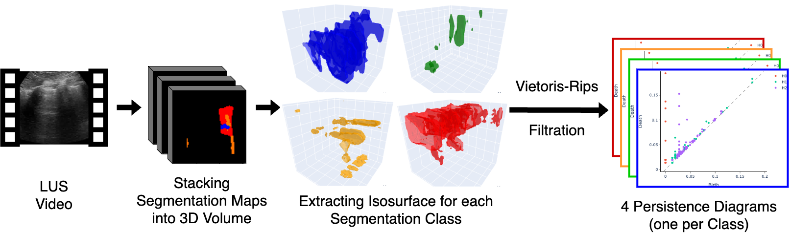

# **Masterthesis**: Deep Learning Models for Lung Ultrasound Analysis: Validation, Evidence Aggregation, and Clinical Factors in COVID-19 Diagnosis

This Repository contains all the code used to produce the results of my master thesis. The thesis is available [here](). At the core of the thesis is the validation of three seminal deep learning approaches for automated COVID-19 diagnosis in lung ultrasound on the novel Maastricht data set.
The three approaches are:

* [VGG16 by Born et al](https://www.mdpi.com/2076-3417/11/2/672)
* [covEcho by Joseph et al.](http://arxiv.org/abs/2206.10183)
* [Segmentation by Roy et al.](https://ieeexplore.ieee.org/document/9093068)

 


As of the time of writing this thesis the Maastricht data set is not yet publically available. Therefore, the repository assumes that the data set is located at a disc location outside this repository. Similarly, the covEcho model and the segmentation model from the Roy et al. publication are not public but have been privately shared with us by the respective authors. This repository therefore assumes that the models have been downloaded and the respective code has been used to predict all frames of the Maastricht data set. The results of these predictions are then used to evaluate the models.

The main files specifying the data mapping are the `load_datasets.py`file in the `data` folder and the `data_utils.py` file in the `utils` folder. To run the code the respective paths need to be adjusted to the location of the data.

The thesis is building upon the work of [Born et al.](https://github.com/jannisborn/covid19_ultrasound). To be able to run the code, especially the training of the VGG16 models, their `pocovidnet` package needs to be installed. Details for the installation can be found in the respective [repository page](https://github.com/jannisborn/covid19_ultrasound/tree/master/pocovidnet).

To run the code successfully install all required packages using the `environment.yml` file. The environment can be created using the command:

```conda env create -f environment.yml```

This environment was created to run the code on a machine using an Apple M1 chip. The respective Tensorflow installations can be modified to run on other machines. A slightly different environment was used for training on the ETH Cluster.

## Contents

This repository contains:

### Main Folders:
The central folders for the thesis results & analysis. They contain their own READMEs with further details.

* `01_VGG_replication`: Code to replicate the results of the VGG16 model by Born et al. on the Maastricht.
* `02_covEcho`: Code to replicate the results of the covEcho model by Joseph et al. on the Maastricht data set.
* `03_Roy_segmentation`: Code to replicate the results of the segmentation model by Roy et al. on the Maastricht data set.
* `04_tda`: Code to replicate the results of the baseline TDA method proposed in the thesis. The code for the other TDA methods are in the `03_Roy_segmentation` folder as they build on the output of the segmentation model.





### Utility Folders:
* `data`: Contains the data loader and the data mapping. Mainly used for the VGG16 replication since the covEcho and Roy models use their own data loading code.
* `Figures`: Contains the figures used in the repository.
* `scripts`: Scripts used to create a frame-level data set from the videos of the Maastricht data set. First run `create_image_dataset.py` and then `create_dataset_index.py`.
* `utils`: Contains various utility functions used throughout the code.
    * `data_utils.py`: Contains the data mapping functions. **Modify this file to point to the correct data locations.**
    * `evaluator.py`: Adapted from [Born et al.](https://github.com/jannisborn/covid19_ultrasound). Contains the evaluation functions used to evaluate the VGG models.
    * `ml_pipeline.py`: Contains the machine learning pipeline used to predict the COVID-19 diagnosis from extracted features by the covEcho, the segmentation model, and the TDA approach.
    * `model_utils.py`: Contains functions used in the training of the VGG16 models.
    * `predict_frames.py`: Predicts all frames in the Maastricht data set using all trained VGG16 models.
    * `statistics.py`: Contains functions to compute the statistics used for VGG16 model evaluation.


### Notebooks:
Since the Maastricht data has not been published as of writing this all Output cells in the Notebooks have been cleared due to data privacy reasons.
* `clinical_data_analysis.ipynb`: Notebook analyzing the clinical variables of the Maastricht data set.
* `manual_severity_analysis.ipynb`: Notebook analyzing the manual severity scores assigned by medical experts to the Maastricht data set videos.
* `predictions_across_models_analysis.ipynb`: Notebook evaluating the VGG16 models on the Maastricht data set. Assumes that the Notebooks in the `02_covEcho` and `03_Roy_segmentation` folders have been run to produce the predictions of the covEcho and the segmentation model.
